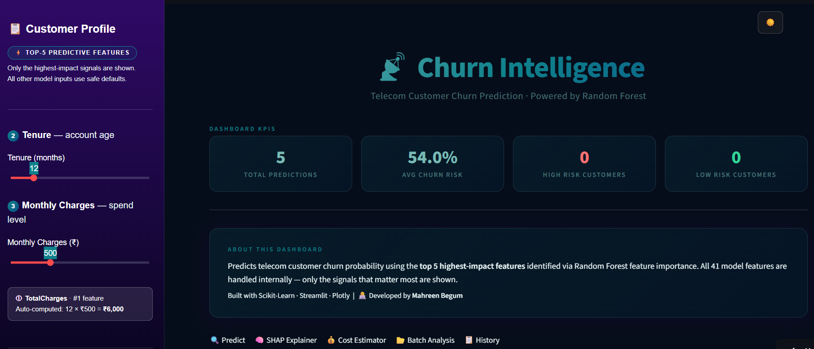

# Churn Intelligence Dashboard

A machine learning-powered telecom customer churn prediction dashboard built with Streamlit, Random Forest, and Plotly. The dashboard provides SHAP-based explainability, batch scoring, retention ROI estimation, prediction history logging, and a fully responsive interface with dark and light themes.


---

## Live Demo

[churnguard-customer1721.streamlit.app](https://churnguard-customer1721.streamlit.app/)

---

## Landing Page



The landing view surfaces the model's top five predictive features for quick input, alongside live KPIs — total predictions, average churn risk, and high/low risk customer counts — and a summary of how the dashboard works.

---

## Features

| Feature | Description |
|---|---|
| **Churn Prediction** | Predicts individual customer churn risk using a three-tier scoring system (Low, Medium, High) |
| **SHAP Explainability** | Visualizes which features drive each prediction up or down |
| **Cost Estimator** | Calculates revenue at risk, campaign ROI, and break-even probability |
| **Batch Analysis** | Scores thousands of customers at once from an uploaded CSV, with downloadable results |
| **Prediction History** | Logs every prediction to SQLite, with trend charts and export |
| **KPI Banner** | Displays live dashboard metrics — total predictions, average risk, and high/low risk counts |
| **PDF Export** | Generates a downloadable prediction report per customer |
| **Dark / Light Theme** | Toggles between themes with a single click |
| **Responsive Layout** | Optimized for desktop, tablet, and mobile screens |

---

## Getting Started

### 1. Clone the repository

```bash
git clone https://github.com/yourusername/churn-intelligence.git
cd churn-intelligence
```

### 2. Install dependencies

```bash
pip install -r requirements.txt
```

### 3. Train the model

```bash
python train_model.py
```

### 4. Run the dashboard

```bash
streamlit run app.py
```

The app opens at `http://localhost:8501`.

---

## Requirements

```txt
streamlit
pandas
numpy
joblib
plotly
scikit-learn
shap
fpdf2
```

Install all dependencies at once with `pip install -r requirements.txt`.

---

## Project Structure

```
churn-intelligence/
│
├── app.py                                   # Main Streamlit dashboard
├── train_model.py                           # Model training script
├── requirements.txt                         # Python dependencies
│
├── churn_model.pkl                          # Trained Random Forest model (auto-generated)
├── scaler.pkl                               # Feature scaler (auto-generated)
├── columns.pkl                               # Feature column names (auto-generated)
├── churn_history.db                          # SQLite prediction log (auto-generated)
│
└── WA_Fn-UseC_-Telco-Customer-Churn.csv      # Dataset (required for training)
```

---

## Model Details

| Property | Value |
|---|---|
| **Algorithm** | Random Forest Classifier |
| **Dataset** | IBM Telco Customer Churn |
| **Features** | 24 behavioral and contractual features |
| **Class Balancing** | `class_weight="balanced"` |
| **Explainability** | SHAP TreeExplainer |

### Key Churn Predictors

| Feature | Churn Signal | Why It Matters |
|---|---|---|
| Contract Type | Very High | Month-to-month customers churn at approximately 42%, compared to approximately 3% for two-year contracts |
| Tenure | High | Customers with less than 12 months of tenure are 3–5 times more likely to churn |
| Monthly Charges | Medium | Higher bills increase price sensitivity, particularly for fiber customers |
| Tech Support | Medium | Lack of support correlates with a greater sense of customer abandonment |
| Payment Method | Medium | Customers paying by electronic check show an approximately 45% higher churn rate |
| Add-on Services | Inverse | Additional services raise switching costs, which lowers churn |

---

## Dashboard Tabs

### Predict

Runs a prediction for a single customer based on sidebar inputs. Displays a risk badge, churn probability gauge, retention recommendations, a feature importance chart, and a correlation heatmap. Includes one-click PDF export.

### SHAP Explainer

Generates a SHAP waterfall chart on demand, showing which features increased or decreased churn risk for the current customer profile. Highlights the top three churn drivers and the top three retention signals.

### Cost Estimator

Accepts customer lifetime value, campaign cost, expected churn reduction percentage, and discount rate as inputs. Outputs revenue at risk, revenue saved, net ROI, and a waterfall chart, and indicates whether the campaign is financially justified.

### Batch Analysis

Scores an uploaded customer CSV row by row, assigns risk tiers, and displays a risk distribution pie chart and probability histogram. The scored file can be downloaded directly from the dashboard.

### History

Logs all predictions to a local SQLite database automatically. Provides a risk trend line over time, a risk tier distribution chart, a full prediction table, and options to clear or export history.

---

## Tech Stack

- **Frontend** — Streamlit with custom CSS (DM Sans font, glassmorphism cards, gradient sidebar)
- **Machine Learning** — Scikit-learn Random Forest with balanced class weights
- **Explainability** — SHAP TreeExplainer
- **Charts** — Plotly Express and Graph Objects
- **Storage** — SQLite for prediction history, Pickle for model artifacts
- **PDF Export** — fpdf2
- **Responsive Design** — CSS media queries for desktop, tablet, mobile, and small-phone breakpoints

---

## Author

**Mahreen Begum**

---

## License

This project is licensed under the MIT License.
